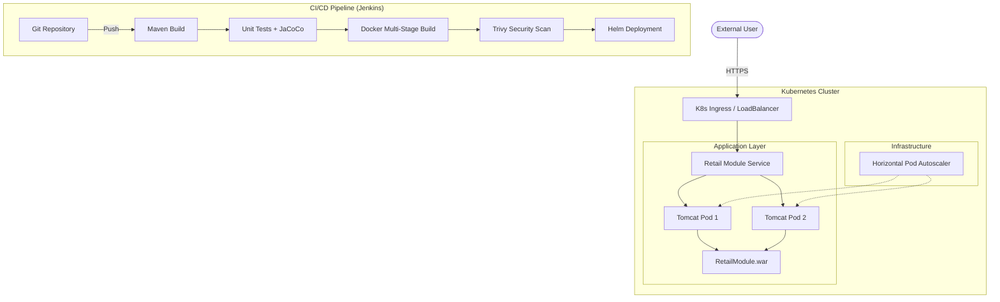

# 🏛️ Enterprise DevOps Platform — Retail Module

[](https://jenkins.io)
[](https://docker.com)
[](https://kubernetes.io)
[](https://helm.sh)
[](https://opensource.org/licenses/MIT)

Welcome to the **Enterprise DevOps Platform**. This project transforms a legacy Java 8 Retail Module into a modern, cloud-native application using industry-standard DevOps practices.

---

## 🏗️ System Architecture

This platform leverages a multi-layered infrastructure to ensure scalability, reliability, and security.



---

## 🚀 Key Features

- **🛡️ Enterprise Grade CI/CD**: A fully automated Jenkins pipeline handling everything from compilation to production deployment.
- **🐳 Modern Containerization**: Multi-stage Docker builds to minimize attack surface and image size.
- **☸️ Professional Orchestration**: Dynamic Helm charts for zero-downtime deployments and environment-specific configurations.
- **🌍 Infrastructure as Code**: Terraform modules for cloud resource provisioning and Ansible for configuration management.
- **📊 Observability & Quality**: Integrated JaCoCo code coverage, JUnit testing, and health probes.

---

## 📁 Project Structure

| Component | Path | Description |
|-----------|------|-------------|
| **Source** | `src/` | Legacy Java 8 business logic (Retail Module). |
| **Jenkins** | `Jenkinsfile` | Declarative pipeline defining the entire lifecycle. |
| **Orchestration** | `charts/` | Helm templates for Kubernetes manifests. |
| **Infrastructure** | `terraform/` | Cloud resource definitions (AWS/GCP/Azure). |
| **Configuration** | `ansible/` | Automated server setup and deployment playbooks. |
| **Docker** | `Dockerfile` | High-performance multi-stage build script. |

---

## 🛠️ Getting Started

### 1. Local Development
Requires Java 8 and Maven 3.8+.
```bash
mvn clean install
# The WAR file will be generated in target/
```

### 2. Containerized Execution
```bash
docker build -t retail-module .
docker run -p 8080:8080 retail-module
```

### 3. Kubernetes Deployment (via Helm)
```bash
helm upgrade --install retail-module ./charts/retail-module
```

---

## 👨‍💻 Author

**Saurabh Singh Rajput**  
*DevOps & Infrastructure Engineer*

---

## 📝 License
This project is licensed under the MIT License - see the [LICENSE](LICENSE) file for details.
